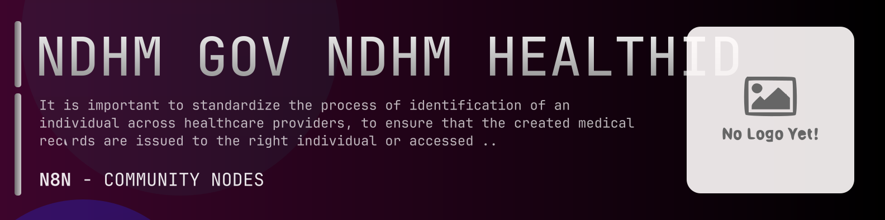

# @n8n-dev/n8n-nodes-ndhm-gov-ndhm-healthid



[](https://www.npmjs.com/package/@n8n-dev/n8n-nodes-ndhm-gov-ndhm-healthid)
[](https://opensource.org/licenses/MIT)

---

**Stop writing ndhm-gov-ndhm-healthid API integrations by hand.**

Every time you connect n8n to ndhm-gov-ndhm-healthid, you waste hours mapping endpoints, defining parameters, and debugging schemas. You copy-paste from docs, fix edge cases, and pray nothing breaks.

**What if connecting n8n to ndhm-gov-ndhm-healthid took 5 minutes, not half a day?**

This node gives you **10+ resources** out of the box: **Authentication**, **Forgot Health ID Number**, **Health Facility**, **Integrated Programs**, **Profile**, and 5 more: with full CRUD operations, typed parameters, and zero manual configuration.

---

## What You Get

- **Zero boilerplate**: Resources, operations, and fields are pre-configured and ready to use
- **Full CRUD**: Create, read, update, and delete support where the API allows it
- **Typed parameters**: No more guessing field types
- **Built-in auth**: API key authentication, ready to go
- **Declarative**: Native n8n performance, no custom execute() overhead

---

## Install

```bash
npm install @n8n-dev/n8n-nodes-ndhm-gov-ndhm-healthid
```

**Or in n8n:**
1. **Settings → Community Nodes → Install**
2. Search: `@n8n-dev/n8n-nodes-ndhm-gov-ndhm-healthid`
3. Click **Install**

---

## Quick Start

1. Install the node (above)
2. Add credentials: **ndhm-gov-ndhm-healthid API** → paste your API key
3. Drag the **ndhm-gov-ndhm-healthid** node into your workflow
4. Pick a resource → pick an operation → done.

That's it. No configuration files. No code. It just works.

---

## Resources

<details>
<summary><b>Authentication</b> (11 operations)</summary>

- Post Authenticate using Health ID number Health ID and password
- Post Authenticate request to generate Mobile OTP using Health ID number Health ID
- Post Authenticate using verified Mobile Number and user data
- Get Auth token public key
- Post Authentication with Aadhaar Biometric based auth transaction
- Post Authentication with Aadhaar OTP based auth transaction
- Post Authenticate using demographic data of user
- Post Authentication with Mobile OTP based auth transaction
- Post Authentication with PASSWORD based auth transaction
- Post Initiate authentication process for given Health ID
- Post Resend Aadhaar Mobile OTP for Authentication Transaction

</details>

<details>
<summary><b>Forgot Health ID Number</b> (4 operations)</summary>

- Post Verify aadhar OTP sent as part of forgetHealth ID
- Post Generate Aadhaar OTP on registrered mobile number
- Post Verify Mobile OTP sent as part of forgetHealth ID
- Post Generate Mobile OTP to start registration

</details>

<details>
<summary><b>Health Facility</b> (7 operations)</summary>

- Post Generate token for heath facility ID
- Post Change password for heath facility ID
- Post Generate Health ID card SVG
- Post Generates password for heath facility ID
- Post Generate health hacility OTP on registrered mobile number
- Get generateSvgCard
- Post Reset password for heath facility ID

</details>

<details>
<summary><b>Integrated Programs</b> (14 operations)</summary>

- Post Generate Aadhaar OTP on registrered mobile number
- Post Create health ID using Aadhaar Number Otp
- Post Create health ID using Biometric Authentication
- Post Create health ID using Aadhaar Demo Auth
- Post De Linked with hid
- Post Linked with hid
- Post Create health ID using mobile Authentication
- Post Generate mobile OTP on registrered mobile number
- Post Create health ID using notify Benefit
- Post Search health ID number using aadhar or aadhar token
- Post Search benefit using health ID number
- Post Update mobile number for account
- Post Update account information
- Post Update health ID status

</details>

<details>
<summary><b>Profile</b> (16 operations)</summary>

- Post Generate Aadhaar OTP on registrered for link account with aadhar number
- Post Verify Aadhaar OTP to complete KYC re KYC verification
- Get List of Benefits associated with HealthID
- Post Change password via Aadhar for heath ID
- Post Change password via mobile for heath ID
- Get Generate Aadhaar OTP on registrered mobile number
- Get Generate Mobile OTP to start registration
- Post Change password via password for heath ID
- Get Generate Health ID card in PDF format
- Get Generate Health ID card PNG
- Get Generate Health ID card SVG
- Delete account
- Get account information
- Post Update account information
- Get Quick Response code in PNG format for this account
- Post Validate auth token

</details>

<details>
<summary><b>Registration With Aadhaar</b> (9 operations)</summary>

- Post Verify Aadhaar OTP on registrered mobile number to create Health ID
- Post Create Health ID using pre verified Aadhaar Mobile
- Post Generate Mobile OTP for verification
- Post Generate Aadhaar OTP on registrered mobile number
- Post Resend Aadhaar OTP on registrered mobile number to create Health ID
- Post Search health ID number using aadhar
- Post Verify Aadhaar using biometrics
- Post Verify Mobile OTP in an existing transaction
- Post Verify Aadhaar OTP and continue for mobile verification

</details>

<details>
<summary><b>Registration With Mobile Number</b> (4 operations)</summary>

- Post Create Health ID with verified mobile token
- Post Generate Mobile OTP to start registration
- Post Resend Mobile OTP for Health ID registration
- Post Verify Mobile OTP sent as part of registration transaction

</details>

<details>
<summary><b>Search</b> (3 operations)</summary>

- Post Search a user by Health IDs
- Post Search a user by Health ID Number
- Post Search users with a mobile number

</details>

<details>
<summary><b>Tags</b> (3 operations)</summary>

- Delete tag against HealthId
- Get list of Tags against HealthID
- Post Add tag against HealthId

</details>

<details>
<summary><b>Utility</b> (2 operations)</summary>

- Get a list of districts in a given State as per LGD
- Get a list of states as per LGD

</details>

---

## Why This Node?

**Without this node:**
- Hours of manual API integration
- Copy-pasting from ndhm-gov-ndhm-healthid docs
- Debugging auth, pagination, error handling
- Maintaining your own client code

**With this node:**
- Install → configure → use. 5 minutes.
- Auto-generated from the official ndhm-gov-ndhm-healthid OpenAPI spec
- Always up to date when the API changes
- Native n8n performance

---

## Auto-Generated
This node was auto-generated from the official **ndhm-gov-ndhm-healthid** OpenAPI specification using
[@n8n-dev/n8n-openapi-node-ultimate](https://github.com/kelvinzer0/n8n-openapi-node-ultimate),
then validated against the live API so you get accurate types and real parameters, not guesswork.

When the ndhm-gov-ndhm-healthid API updates, this node updates too.

---

## Support This Project

If this node saved you hours of work, consider supporting continued development, new APIs, better error handling, and faster updates.

[](https://n8n-code.github.io/membership/#/eyJ0aXRsZSI6IktlZXAgSXQgTW92aW5nIiwiZGVzYyI6Ik9uZSBkZXZlbG9wZXIgYnVpbHQgYSB0b29sIHRoYXQgYXV0by1nZW5lcmF0ZXNcbm44biBub2RlcyBmcm9tIGFueSBPcGVuQVBJIHNwZWMuXG5cbllvdXIgZG9uYXRpb24gZnVuZHMgbmV3IGZlYXR1cmVzLCBtb3JlIEFQSSBzdXBwb3J0LFxuYW5kIGJldHRlciB0b29saW5nIGZvciBldmVyeSBkZXZlbG9wZXIgYWZ0ZXIgeW91LiIsInRhcmdldCI6NTAwMCwiYWRkcmVzc2VzIjp7ImV0aGVyZXVtIjoiMHhmMDU1NWQ0MGRiRkI0ZTNCZjA3MDQ0MjgyQjc4RjJmRTFmNTFFZjcyIiwic29sYW5hIjoiNlpEVk5BYmpZZExEcXo4cGt3VUNHYllaNVV3QlFranB0QzU1Wk5vTFcybVUifSwiZGlzY29yZCI6Imh0dHBzOi8vZGlzY29yZC5nZy9wdERaOGU0aDkzIn0)

---

## License

MIT © [kelvinzer0](https://github.com/n8n-code)
